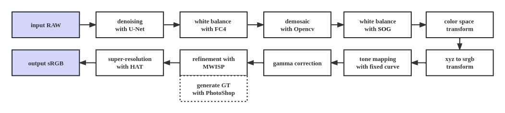

# NEW Deep-FlexISP for Night Photography Rendering Challenge 2023

By Shuai Liu, Chaoyu Feng, Guangqi Shao, Hao Wang, Xiaotao Wang, Lei Lei

Xiaomi Inc., China

## NTIRE 2023 Night Photography Rendering Challenge
Our __NEW Deep-FlexISP__ won the __third place__ in people’s choice and the __first place__ in photographer’s choice in [NTIRE 2023 Night Photography Render Challenge](https://nightimaging.org/index.html).

## Introduction
We made improvements based on [Deep-FlexISP](https://github.com/q935970314/Deep-FlexISP), and the overall pipeline is shown in the figure. We keep the denoising and white balance modules unchanged, and split the implementation of the Bayer to sRGB module into several sub-modules, as follows. 

The input image is first processed by the Bayer domain denoising module, which utilizes a simplistic U-Net. Following this, the [FC4](https://github.com/matteo-rizzo/fc4-pytorch) network is employed to predict white balance parameters and adjust the Bayer image accordingly. The Bayer image is then subjected to a demosaic operation utilizing the [OpenCV](https://opencv.org/) library's built-in functions. Since white balance is conducted in the Bayer domain during the second stage, the white balance parameters are predicted and corrected using the [Shades of Gray](https://pubag.nal.usda.gov/download/27179/pdf) in the RGB domain. The image is then subjected to color space conversion and at this point, has been converted from Bayer to sRGB. Using a fixed curve, tone mapping is carried out on the sRGB image, and gamma correction with a value of $\gamma=3.2$ is applied. [MWISPNet](https://github.com/cszhilu1998/MW-ISPNet) is used to enhance the image by adjusting brightness, contrast, saturation, and other parameters. The ground truth used in the MWISPNet training is obtained by manual post-processing in [PhotoShop](https://www.adobe.com/products/photoshop.html). Training high-resolution images is a challenging task, and GPU memory limitations are a significant constraint. As such, we downsample the image, enhance it, and perform super-resolution through [HAT](https://github.com/XPixelGroup/HAT) before obtaining the output sRGB image.



## Usage (Docker)

run:
```
docker build -t mialgo .
docker run --gpus all -it --rm -v $PWD/data:/data mialgo ./run.sh
```

## Acknowledgement
Part of our codes are adapted from [fc4-pytorch](https://github.com/matteo-rizzo/fc4-pytorch), [MW-ISPNet](https://github.com/cszhilu1998/MW-ISPNet) and [HAT](https://github.com/XPixelGroup/HAT). we thank the authors for their contributions.

## BibTex
```
@InProceedings{Liu_2022_CVPR,
    author    = {Liu, Shuai and Feng, Chaoyu and Wang, Xiaotao and Wang, Hao and Zhu, Ran and Li, Yongqiang and Lei, Lei},
    title     = {Deep-FlexISP: A Three-Stage Framework for Night Photography Rendering},
    booktitle = {Proceedings of the IEEE/CVF Conference on Computer Vision and Pattern Recognition (CVPR) Workshops},
    month     = {June},
    year      = {2022},
    pages     = {1211-1220}
}
```

## Contacts
Please feel free to open an issue or to send an e-mail to ```liushuai21@xiaomi.com```