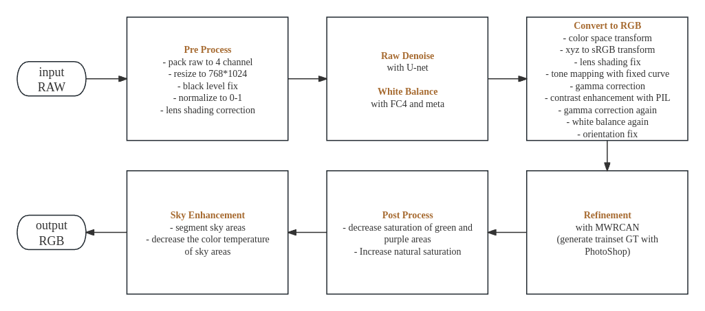

# NEW NEW Deep-FlexISP for Night Photography Rendering Challenge 2024

By Shuai Liu, Jingyuan Xiao, Chaoyu Feng, Hao Wang, Guangqi Shao, Yuqian Zhang, Yibin Huang, Wei Luo, Liming Wang, Xiaotao Wang, Lei Lei

Xiaomi Inc., China

## NTIRE 2024 Night Photography Rendering Challenge
Our __NEW NEW Deep-FlexISP__ won the __second place__ in people’s choice and the __first place__ in speed performance in [NTIRE 2024 Night Photography Render Challenge](https://nightimaging.org/final-leaderboard.html). 

## Introduction
We made improvements based on Deep-FlexISP. 

First, we pre-process the input image, including packing raw to 4 channels, down-sampling the image (to $768 \times 1024$), correcting the black level (adjusting value based on the noise profile), normalizing (to 0-1), and correcting lens shading (adjusting shading mask based on the provided calibration image and the noise profile). It is worth noting that we downsample the image to the required size at the beginning, which ensures that our whole processing is as fast as possible. 

Next, we use the pre-trained Unet for raw domain denoising, and use the pre-trained FC4 and meta info (as\_shot\_neutral) for white balance parameters estimation. 

Then we convert the raw image to RGB image with color space transform (fixed matrix), XYZ to sRGB transform (fixed matrix), lens shading fix (increase shading of dark scenes and decrease saturation), tone mapping (fixed curve), gamma correction (fixed parameter), contrast enhancement (python-pillow-autocontrast), gamma correction again (fixed parameter), white balance correction again (grayness index), and orientation fix. 

We use neural networks for the refinement of the RGB images. The model structure is based on MWRCAN. The ground truth of the training data is generated using Photoshop. 

Then we post-process the image, decreasing the saturation of green and purple areas (uncommon and weird colors at night), and increasing the natural saturation of the whole image. 

Finally, we train a segmentation model to segment the sky areas and decrease the color temperature, which makes the sky more blue and cold.




## Pretrained checkpoint
[google drive](https://drive.google.com/file/d/1HSMcNxjqGtcQgOHs4NtHO6rDfsRdXv91/view?usp=sharing)


## Usage (Docker)

run:
```
docker build -t mialgo24 .
cd DATA_FOLDER_PATH
docker run -it --rm --gpus all -v $(pwd)/data:/data mialgo24 ./run.sh
```

## Acknowledgement
Part of our codes are adapted from [fc4-pytorch](https://github.com/matteo-rizzo/fc4-pytorch), [MW-ISPNet](https://github.com/cszhilu1998/MW-ISPNet) and [HAT](https://github.com/XPixelGroup/HAT). we thank the authors for their contributions.

## BibTex
```
@InProceedings{Liu_2022_CVPR,
    author    = {Liu, Shuai and Feng, Chaoyu and Wang, Xiaotao and Wang, Hao and Zhu, Ran and Li, Yongqiang and Lei, Lei},
    title     = {Deep-FlexISP: A Three-Stage Framework for Night Photography Rendering},
    booktitle = {Proceedings of the IEEE/CVF Conference on Computer Vision and Pattern Recognition (CVPR) Workshops},
    month     = {June},
    year      = {2022},
    pages     = {1211-1220}
}
```

## Contacts
Please feel free to open an issue or to send an e-mail to ```liushuai21@xiaomi.com```