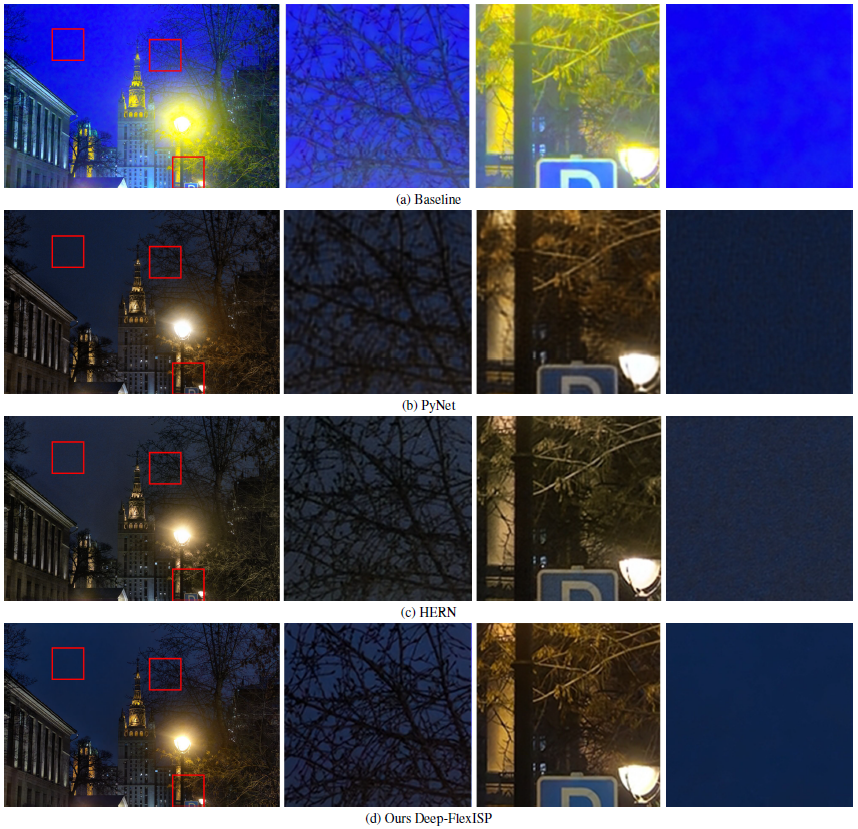
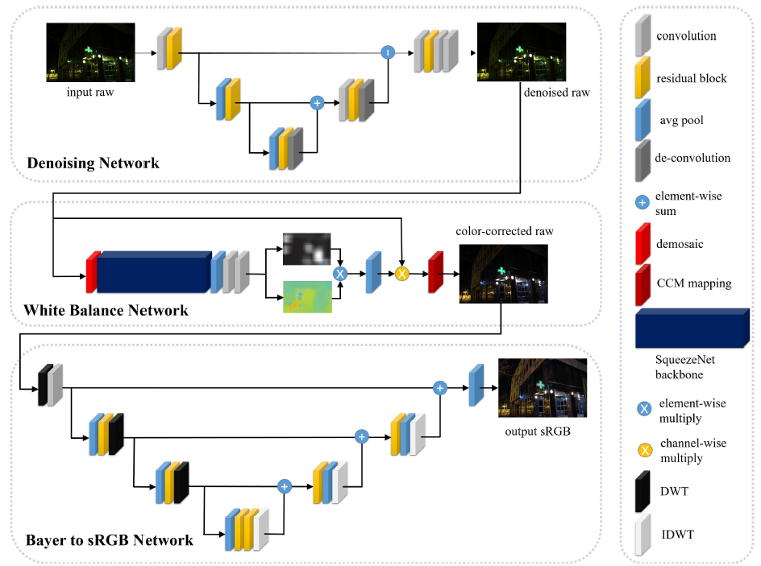

# Deep-FlexISP: A Three-Stage Framework for Night Photography Rendering

By Shuai Liu, Chaoyu Feng, Xiaotao Wang, Hao Wang, Ran Zhu, Yongqiang Li and Lei Lei

Xiaomi Inc., China

This is the official implementation of our paper [Deep-FlexISP: A Three-Stage Framework for Night Photography Rendering](https://openaccess.thecvf.com/content/CVPR2022W/NTIRE/papers/Liu_Deep-FlexISP_A_Three-Stage_Framework_for_Night_Photography_Rendering_CVPRW_2022_paper.pdf).





## Introduction
Night photography rendering is challenging due to images’ high noise level, less vivid color, and low dynamic range. In this work, we propose a three-stage cascade framework named Deep-FlexISP, which decomposes the ISP into three weakly correlated sub-tasks: raw image denoising, white balance, and Bayer to sRGB mapping, for the following considerations. First, task decomposition can enhance the learning ability of the framework and make it easier to converge. Second, weak correlation sub-tasks do not influence each other too much, so the framework has a high degree of freedom. Finally, noise, color, and brightness are essential for night photographs. Our framework can flexibly adjust different styles according to personal preferences with the vital learning ability and the degree of freedom. Compared with the other Deep-ISP methods, our proposed Deep-FlexISP shows state-of-the-art performance.


## NTIRE22 Night Photography Rendering Challenge
Our Deep-FlexISP won the ##first place## in people’s choice and photographer’s choice in NTIRE 2022 Night Photography Render Challenge. For more information please refer [here](https://openaccess.thecvf.com/content/CVPR2022W/NTIRE/papers/Ershov_NTIRE_2022_Challenge_on_Night_Photography_Rendering_CVPRW_2022_paper.pdf)


## Usage

### Requirements
* Python 3.6.13
* Pytorch 1.7.1
* Tensorflow 1.15.1

### Dataset
Download the dataset from [NTIRE2022 Night Photography Rendering Challenge](https://nightimaging.org/). And put ".png" and ".json" files into the "data" folder.

### Evaluation
```
bash ./run.sh
```

## Docker (recommended)
The docker container can be downloaded from [here](https://drive.google.com/file/d/1f6EhX3kZvgE6FIj0dRnGuCVryT3BIYOz/view?usp=sharing).

run:
```
docker import ./mialgo.tar mialgo
docker run --gpus all -it --rm -v $PWD/data:/data mialgo /bin/bash
```

## Acknowledgement
Part of our codes are adapted from [fc4-pytorch](https://github.com/matteo-rizzo/fc4-pytorch) and [MW-ISPNet](https://github.com/cszhilu1998/MW-ISPNet). we thank the authors for their contributions.

## BibTex
```
@InProceedings{Liu_2022_CVPR,
    author    = {Liu, Shuai and Feng, Chaoyu and Wang, Xiaotao and Wang, Hao and Zhu, Ran and Li, Yongqiang and Lei, Lei},
    title     = {Deep-FlexISP: A Three-Stage Framework for Night Photography Rendering},
    booktitle = {Proceedings of the IEEE/CVF Conference on Computer Vision and Pattern Recognition (CVPR) Workshops},
    month     = {June},
    year      = {2022},
    pages     = {1211-1220}
}
```

## Contacts
Please feel free to open an issue or to send an e-mail to ```liushuai21@xiaomi.com```